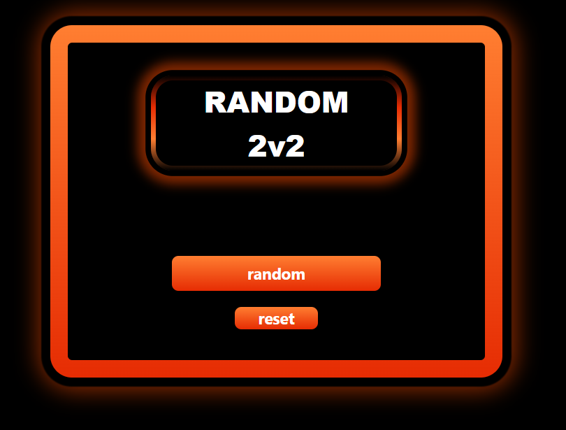

# Features
## 4.0
### script.js
- string random
- createButton.name toLowerCase()
- function ShowNextMatch()
### style.css
- gradient borders colors
- cover layout 
- button active shadow
- `Arial Narrow font-family`
- `border img - border radius`
-                                  Final layout
- 

## 4.1
### script.js
- `showRandomAnimation()`
### style.css
- `button box-shadow ++`